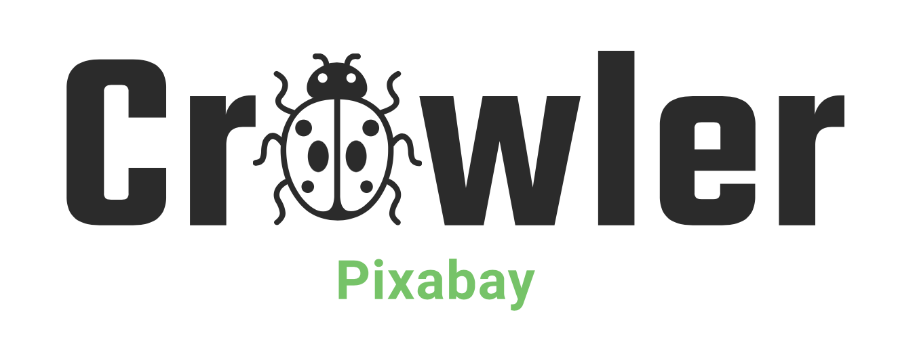

<!-- PROJECT LOGO -->
<br />
<p align="center">
  <a href="http://zhaozhang.net/data.html">
    
  </a>

  <h3 align="center">Crawling Images on Pixabay by Category</h3>

  <p align="center">
    An easy to use crawler for making datasets
    <br />
    <a href="http://zhaozhang.net/data.html"><strong>⭐ Project Home »</strong></a>
    <br />
  </p>
</p>


***
Pixabay is an international, copyleft, and free-to-use website for sharing photos, illustrations, vector graphics, film footage, and music.
> You can copy, modify, distribute, and use the images, even for commercial purposes, all without asking for permission or giving credits to the artist. ([link](https://pixabay.com/zh/service/license/))

Here we release an easy-to-use crawler. Users can specify image category, resolution, *etc*. The crawler will crawl the image and the corresponding license.

## Prerequisites
* pip install python-pixabay

## Usage
### 1. Configure `pixabay_config.json`
* `keywords_file`: JSON file of custom category;
* `save_root`: Where to store pictures and licenses;
* `pixabay_api_key`: Sign up [here](https://pixabay.com/accounts/register/) to get the api key;
* `url_keys`: Used to set the resolution.
  * `previewURL`: Low resolution images with a maximum width or height of 150 px;
  * `webformatURL`: Medium sized image with a maximum width or height of 640 px;
  * `largeImageURL`:Scaled image with a maximum width/height of 1280px;
* `npage`: The larger the value, the larger the search scope.
```json
{
    "keywords_file": "./keywords.json",
    "save_root": "./Images", 
    "pixabay_api_key": "Your Key",
    "url_keys": "webformatURL",
    "npage":2
}
```

### 2.Configure `keywords.json`
The form is as 
`"Class name"` : `"Search keyword"`
```json
{
    "camera" : "camera",
    "earphone" : "AirPods"
}
```

### 3. Run by
```shell
python pixabay_crawler.py
```

